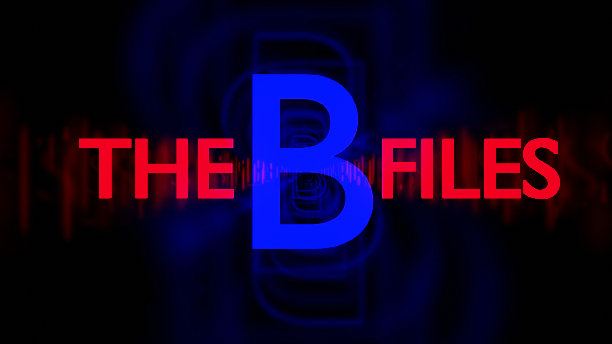

<a id="top"></a>

<p align="center">
  
  
  
  
  
  
  
  
</p>

<h1 id="centered-header" align="center">$${\color{blue}B}\ {\color{red}Project}$$</h1>



> [!WARNING]
> https://b.sof.cloud

> [!CAUTION]
> Truth is the best Psyop

***
***

<h1 align="center">Table of Contents</h1>

<div align="center">
  <details>
    <summary>Click to Expand</summary>
    <ul align="left">
      <li><a href="#Description">Description</a></li>
      <li><a href="#Community">Community</a></li>
      <li><a href="#Work List">Work List</a></li>
      <li><a href="#Contribution">Contribution</a></li>
      <li><a href="#Credits">Credits</a></li>
      <li><a href="#License">License</a></li>
      <li><a href="#Contact">Contact</a></li>
    </ul>
  </details>
</div>

***
***

<h1 align="center">Description</h1>

 - B Logs HTML webpage of posts.

 1) Place this file into the same folder with B log images. 
 2) Open the .html file webpage. 

 - It will show posts with meta for ids, post #, hosts, show images, dates, bread links, and links to posts.

 - Sgt B 8kun Logs (pics)
https://drive.google.com/drive/folders/1tdM9MrOoYFf4RPQsn2FX1yuIpmFS50D2

***
***

<h1 align="center">Community</h1>

 - There is a community board set up for users to discuss the ongoing project of Cicada puzzles.
 - Have ideas or questions? [Join the Discussion](https://github.com/BHQST/Q_Project/B_project/discussions) to connect with others and share your thoughts!
	
***
***

<h1 align="center">Work List</h1>

 - [ ] Clean up README.md
 - [ ] Get Folder structure cleaned up.
 - [ ] Get the pdfs done like the [Q_Project](https://can-add-link.com)
 - [ ] Clean up the Description area.
	
***
***

<h1 align="center">Contribution</h1>

 - We welcome contributions to enhance the project!
 - Feel free to submit issues or pull requests to enhance the project.

1. **Fork the repository.**
2. **Clone the repository to your local machine:**
```bash
git clone https://github.com/BHQST/Q_Project/B_Project.git
cd Q_Project/B_Project
```
3. **Create a new branch  for your future or fix:**
```bash
git checkout -b New_Addition
```
4. **Make your changes and commit them:**
```bash
git commit -m "Add new sauce"
```
5. **Push your changes to the new branch:**
```bash
git push origin New_Addition
```
6. **Open a pull request.**
 - Go to the repository on GitHub.
 - Compare your branch with the `main` branch and create a pull request.

***
***

<h1 align="center">Credits</h1>

 - Baron Of Arizona
 - Sgt B
 - BabyFist
 - The Ghost's

***
***

<h1 align="center">License</h1>

 - See the [LICENSE](LICENSE) file for details.

***
***

<h1 align="center">Contact</h1>

 - For questions or feedback, contact Ghost Squad at theforgedesign@protonmail.com.

***
***

<p align="center">
  <a href="#top">Back To Top</a>
</p>


